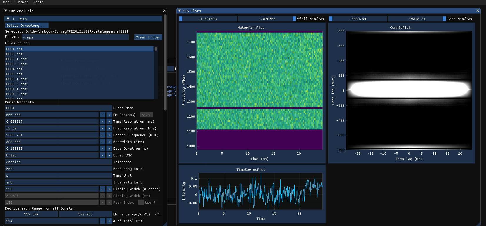

# Frbgui

Frbgui is a graphical user interface for measuring spectro-temporal properties of Fast Radio Bursts from their waterfalls using 2D autocorrelations. It can be used to split bursts with multiple components, change the dispersion measure (DM), add noise filters, and other preparation tasks before measurement.

After measurement, Frbgui can be used to review and fix incorrect measurements by supplying initial guessues, producing an output pdf of all measurements and spreadsheets of measured values. Spreadsheets produced in this way can be loaded back into the Frbgui for further work or different sessions of measurements.

Measurements can be performed over a range of DMs and include the burst frequency, the sub-burst slope and/or drift rate, burst duration and burst bandwidth.

Features include:
* Changing the DM of a burst
* Cropping waterfalls
* RFI mitigation via background subtraction, SK-SG filter, manual channel zapping, and mask ranges
* Import and export of noise masks
* Measurements over user-defined ranges of DMs
* Waterfall downsampling in frequency and time
* User-defined splitting of bursts with arbitrary numbers of sub-burst components
* User-defined inital fit guesses
* Measurement review via the output table
* Correct individual fits by DM
* Output measurements as a `csv` spreadsheet and/or PDF with plots of each waterfall with its measurements.


The GUI is extensible and pull requests are welcome.

## Status

Currently Frbgui works best with waterfalls saved as 2d numpy arrays (See [Usage](#usage) for more details). Frbgui is functional and can produce thousands of measurements but is quirky, buggy, and not tested on different platforms. Frbgui will run on any platform but with varying performance.

## Installation

Install Frbgui with

```pip install --user frbgui```

## Acknowledgements

If used in an academic study please cite

"A broad survey of spectro-temporal properties from FRB20121102A", Chamma, Mohammed A. ; Rajabi, Fereshteh ; Kumar, Aishwarya ; Houde, Martin. Oct. 4 2022. Submitted to MNRAS.
[arxiv:2210.00106](https://arxiv.org/abs/2210.00106),
[ADS:2022arXiv221000106C](https://ui.adsabs.harvard.edu/abs/2022arXiv221000106C/abstract)

## Usage



### Getting Started

Run from the command-line with the following command to start in your current working directory:

```bash
frbgui
```

In a python script, you can invoke the gui in the following way:

```python
from frbgui import frbgui

frbgui() # starts the GUI
```

At the moment frbgui works best with burst waterfalls that are prepared as python `.npz` archives. The following snippet shows the format of the archive and an example of how a burst can be saved in the right format:
```python
wfall = # 2D numpy array with shape (num freq channels, num time channels)
burstmetadata = {
    ### required fields:
    'dfs'       : # array of frequency channels in MHz,
    'DM'        : # dispersion measure (DM) in pc/cm^3, float
    'bandwidth' : # bandwidth of `wfall` in MHz, float
    'duration'  : # duration of `wfall` in seconds, float
    ### optional fields:
    'center_f'  : # burst frequency in MHz, optional,
    'freq_unit' : # string of freqeuncy unit, e.g. 'MHz', optional,
    'time_unit' : # string of time unit, e.g. 'ms', optional,
    'int_unit'  : # string of intensity unit, e.g. 'Jy', optional,
    'telescope' : # string of observing telescope, e.g. 'Arecibo', optional,
    'burstSN'   : # float of signal to noise ratio, optional,
    'tbin'      : # float of time resolution, optional
}

np.savez('burst.npz', wfall=wfall, **burstmetadata)
```

Optional fields are used for display purposes and do not otherwise affect measurements from within `frbgui`.

<!-- ### Separating bursts with multiple components -->

## Documentation

### Output CSVs

`frbgui` outputs measurements as a spreadsheet along with a corresponding PDF that contains plots of each burst waterfall with its measurements overlaid.
The output spreadsheet is arranged by one measurement per row under the following columns:

Note:
* Plaintext columns like "slope (mhz/ms)" indicate a measurement.
* *Italicized* columns indicate information about how the measurement was taken, such as "time_res (s)".
* ~~Stricken~~ column names indicate a deprecated column and normally should not be used.

| Column Name | Description |
| ---: | --- |
| name | The name of the burst file measured, potentially suffixed with a letter (e.g., “a”, “b”, “c”) denoting the sub-pulse |
| DM | The particular trial DM used to perform measurements |
| center_f | The center frequency of the burst as measured by frbgui |
| center_f_err | The propagated uncertainty on center_f |
| slope (mhz/ms) | The sub-burst slope, obtained from the cotangent of the fit angle  |
| slope error (mhz/ms) | The propagated uncertainty on the slope |
| theta | The angle of the semi major axis of the fit ellipse measured counter-clockwise from the positive y-axis |
| red_chisq | Reduced chi-squared indicating the goodness-of-fit of the 2D Gaussian to the 2D ACF |
| amplitude | Amplitude of the 2D Gaussian fit. Not normalized.  |
| xo | Central x-position (time) of the 2D gaussian fit to the 2D-ACF |
| yo | Central y-position (frequency) of the 2D gaussian fit to the 2D-ACF |
| sigmax | Standard deviation in x (time if vertical) of the 2D gaussian fit to the 2D-ACF  |
| sigmay | Standard deviation in y (frequency if vertical) of the 2D gaussian fit to the 2D-ACF |
| angle | The fit angle. Equivalent to theta up to a difference of pi/2 due to the ambiguity between axes when fitting |
| amp_error | The fit uncertainty on the amplitude |
| xo_error | The fit uncertainty on xo |
| yo_error | The fit uncertainty on yo |
| sigmax_error | The fit uncertainty on sigmax |
| sigmay_error | The fit uncertainty on sigmay |
| angle_error | The fit uncertainty on angle |
| slope_abs | The absolute value of slope (mhz/ms). If negative, this indicates a potential measurement issue |
| slope_over_nuobs | 'slope_abs’ / ‘center_f’. In the TRDM, this is proportional to 1/’tau_w_ms’ |
| slope_over_nuobs_err | The propagated 2D gaussian fit uncertainty for ‘slope_over_nuobs’.  |
| recip_slope_over_nuobs | The reciprocal of slope_over_nuobs |
| slope_abs_nuobssq | 'slope_abs’ / ‘center_f**2’. In the TRDM, this is proportional to a constant. |
| min_sigma | Same as either sigmax or sigmay, whichever is smaller  |
| max_sigma | Same as either sigmax or sigmay, whichever is larger  |
| min_sigma_error | Same as either sigmax_error or sigmay_error, associated with whichever sigma is smaller  |
| max_sigma_error | Same as either sigmax_error or sigmay_error, associated with whichever sigma is larger  |
| tau_w | The sub-burst duration in milliseconds as defined in Chamma et al. (2022). |
| tau_w_error | The propagated uncertainty on tau_w (ms) |
| tau_w_ms | The sub-burst duration in milliseconds as defined in Chamma et al. (2022). An alias of tau_w. Units are implied by the choice of coordinates when fitting |
| bandwidth (mhz) | Best-fit bandwidth for the sub-pulse in MHz  |
| bandwidth error (mhz) | Propagated uncertainty for the bandwidth in MHz |
| *f_res (mhz)* | The frequency resolution (MHz) of the final waterfall used for the FRBGUI measurements |
| *time_res (s)* | The time resolution (seconds) of the final data array used for the FRBGUI measurements |
| *downf* | The factor by which the file was downsampled in frequency from FRBGUI from the original waterfall |
| *downt* | The factor by which the file was downsampled in time from FRBGUI from the original waterfall |
| *fchans* | The number of frequency channels remaining after the downsample in FRBGUI |
| *tchans* | The number of time channels remaining after the downsample in FRBGUI |
| *tsamp_width* | The number of time channels set by the user in FRBGUI used for measurement (i.e., the width of the waterfall) |
| *subbg_start (ms)* | The time, in ms, from the start of the file that the user-defined background sample begins |
| *subbg_end (ms)* | The time, in ms, from the start of the file that the user-defined background sample ends |
| *sksigma* | The sigma chosen for the SK-SG filter, which performs RFI removal |
| *skwindow* | The window chosen for the SK-SG filter, which performs RFI removal |
| *regstart_a* | When using regions, the start of the “a” subpulse region in ms  |
| *regend_a* | When using regions, the end of the “a” subpulse region in ms  |
| *regstart_b* | When using regions, the start of the “b” subpulse region in ms  |
| *regend_b* | When using regions, the end of the “b” subpulse region in ms  |
| *background* | The size of the background subpulse region in ms. Used to pad sub-pulses with zeroes, which improves measurement stability. Background region is assumed to start from 0 ms |
| ~~sigma_t~~ | The product of min_sigma and time_res (s). This is a (poor) measure of burst duration. Use tau_w or tau_w_ms for duration instead |
| ~~tau_w_old~~ | The sub-burst duration as defined and used in Chamma et al. (2021). Due to the choice of coordinates when performing fits, this form can be subject to larger uncertainties when the burst is near vertical |
| ~~t_from_sigma~~ | The product of min_sigma and sin(theta). This is a (poor) measure of burst duration when finding fits with physical coordinates |
| ~~sigma_t_ms~~ | 'sigma_t’ in ms. See sigma_t |
| ~~tau_w_ms_old~~ | tau_w_old in milliseconds |

Thanks to Dr. Sofia Sheikh for contributions to this table.
