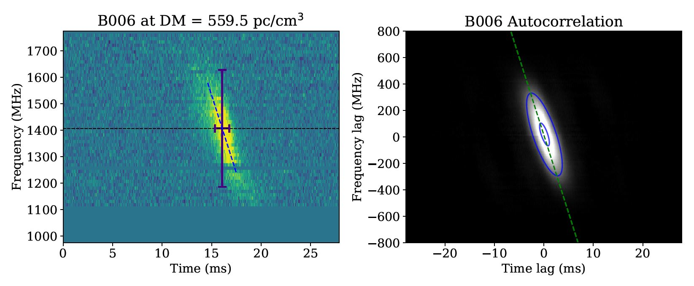

# A broad survey of spectro-temporal properties from FRB20121102A

Please see the sister repository https://github.com/mef51/SurveyFRB20121102A for the most up-to date information.

Reference: "A broad survey of spectro-temporal properties from FRB20121102A", Chamma, Mohammed A. ; Rajabi, Fereshteh ; Kumar, Aishwarya ; Houde, Martin. Oct. 4 2022. Submitted to MNRAS.
[arxiv:2210.00106](https://arxiv.org/abs/2210.00106),
[ADS:2022arXiv221000106C](https://ui.adsabs.harvard.edu/abs/2022arXiv221000106C/abstract)

## Measurements and Figures

All measurements and plots of the bursts are available in the [`results/`](results/) folder.
Each row lists the burst name and DM the measurements were performed at. Each burst is measured over a range of DMs between 555 to 575 pc/cm^3.

Measurements are available as `csv` spreadsheets. Spreadsheets are broken down by their respective publication. For a spreadsheet with all bursts combined see ['AllMeasurements_10003rows_Aug27.csv'](results/AllMeasurements_10003rows_Aug27.csv). These spreadsheets can be loaded in any spreadsheet program or with `pandas`. For example:
```python
df = pd.read_csv('AllMeasurements_10003rows_Aug27.csv').set_index('name')
```

Below is figure showing an example measurement. Figures analogous to the one shown below for all bursts and at each DM are available as large PDF files provided via request.


